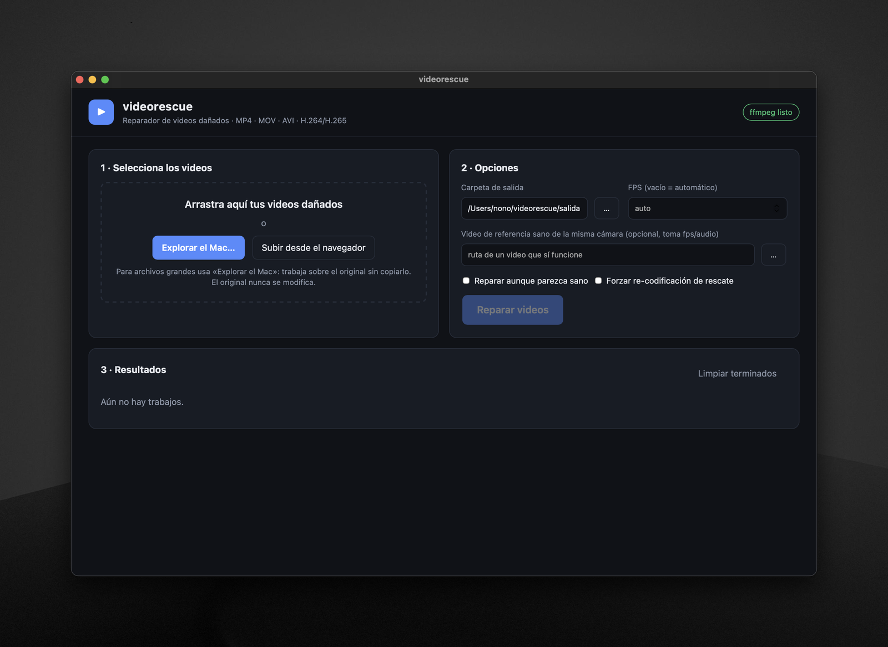

<p align="center">
  
</p>

<h1 align="center">videorescue</h1>

<p align="center">
  Reparador <b>100 % local</b> de videos dañados. Tus archivos nunca salen de tu equipo.
</p>

<p align="center">
  
  
  
</p>

<p align="center">
  
</p>

---

## ¿Qué hace?

Recupera videos que no se reproducen: grabaciones truncadas, cámaras o DVR que se apagaron a mitad de grabación, tarjetas SD corruptas, archivos sin cabecera…

Prueba varias estrategias en orden y **valida cada resultado decodificándolo** antes de darlo por bueno:

1. **Reconstrucción del `moov`** (al estilo *untrunc*): escanea el `mdat`, localiza los frames H.264 y los chunks de audio intercalados (PCM A-law/µ-law) y genera un índice nuevo. Arregla la falta de `moov`, una cabecera `ftyp` destruida o un archivo truncado.
2. **Remux tolerante** con ffmpeg (`-c copy`, ignorando errores).
3. **Extracción Annex-B** (H.264/H.265 crudo, típico de DVR).
4. **Re-codificación de rescate** (libx264) si las anteriores dejan errores.

> **Video de referencia.** En un MP4 normal los parámetros del códec (SPS/PPS) solo existen en el índice (`moov`), que es lo que se pierde. Para reconstruirlo indica un **video sano grabado con el mismo dispositivo y ajustes** (mismo códec y resolución). Si el audio es AAC no puede reindexarse, y se recupera solo el video. El audio PCM A-law/µ-law de DVR sí se recupera.

El original **nunca se modifica**. Si un archivo está lleno de `0xFF`/`0x00` se informa como *sin datos* (irrecuperable).

Formatos: MP4, MOV, M4V, AVI, MKV, 3GP, TS/MTS, H.264/H.265 crudo, DAV, WebM, FLV, WMV, MPG…

## Instalación

### Aplicación de escritorio (recomendado)

Descarga el instalador desde [Releases](../../releases):

| Sistema | Archivo |
|---|---|
| macOS (Apple Silicon) | `videorescue.dmg` → arrastra la app a *Aplicaciones* |
| Windows | `videorescue.exe` (carpeta `videorescue`) |

> **macOS:** la app no está firmada por Apple, así que la primera vez aparece el aviso *"Apple no ha podido verificar que videorescue.app no contenga software malicioso"*. Para abrirla:
> 1. Intenta abrir la app y cierra el aviso.
> 2. Ve a *Ajustes del Sistema → Privacidad y seguridad* y pulsa **Abrir igualmente**.
>
> O, desde la terminal: `xattr -dr com.apple.quarantine /Applications/videorescue.app`
>
> En macOS 14 o anterior también sirve clic derecho → *Abrir*.
>
> **Windows:** SmartScreen puede avisar por lo mismo. Pulsa *Más información → Ejecutar de todas formas*.

Los resultados se guardan por defecto en `~/videorescue/salida`.

### Desde el código fuente

```bash
git clone https://github.com/NonoDev-72/videorescue.git
cd videorescue
./scripts/run.sh          # crea .venv, instala dependencias y abre http://127.0.0.1:5055
```

O manualmente:

```bash
python3 -m venv .venv && source .venv/bin/activate
pip install -r requirements.txt
python -m videorescue              # interfaz en el navegador
pip install pywebview
python -m videorescue --desktop    # ventana nativa
```

No hace falta instalar ffmpeg: se incluye a través de [`imageio-ffmpeg`](https://github.com/imageio/imageio-ffmpeg) (si ya tienes uno en el `PATH`, se usa ese).

## Privacidad

- El servidor escucha **solo en `127.0.0.1`**: no es accesible desde la red.
- No hay telemetría, CDN, fuentes externas ni llamadas a internet.
- La reparación se hace en tu equipo.

## Compilar los instaladores

```bash
./packaging/build_mac.sh          # → dist/videorescue.dmg   (en macOS)
packaging\build_windows.bat       # → dist\videorescue\videorescue.exe   (en Windows)
python tools/make_icon.py         # regenera assets/icon.{png,ico,icns}
```

PyInstaller no compila entre sistemas, así que cada instalador se genera en su propio sistema operativo.

## Tests

```bash
pip install -e ".[dev]"
pytest
```

Los tests generan un video de prueba con el ffmpeg incluido, lo dañan (truncado, sin índice, cabecera destruida) y comprueban que se repara, que el original no se modifica y que la API local funciona.

**Limitaciones conocidas** (marcadas como `xfail` en los tests):
- Videos con **fotogramas B**: se reparan y se reproducen, pero ffmpeg avisa de marcas de tiempo no monótonas.
- Audio AAC **intercalado paquete a paquete** (muxado por defecto de ffmpeg): el escáner no localiza los frames sueltos. Con audio en bloques (grabaciones de pantalla, DVR) funciona.

## Estructura

```
videorescue/
├── app.py            # servidor Flask + API de trabajos
├── desktop.py        # ventana nativa (pywebview)
├── repair/           # motor de reparación (analyze, rebuild, engine, ffmpeg_tools)
└── static/           # interfaz web (HTML/CSS/JS)
tests/                # suite de pytest
assets/               # icono de la aplicación
packaging/            # scripts de empaquetado (PyInstaller)
scripts/              # utilidades de desarrollo
tools/                # generador del icono
```

## Historial de cambios

Consulta el [CHANGELOG](CHANGELOG.md) o los [Releases](../../releases).

## Contribuciones y seguridad

Las contribuciones requieren aprobación previa: lee [CONTRIBUTING.md](CONTRIBUTING.md). Para reportar vulnerabilidades, consulta [SECURITY.md](SECURITY.md).

## Licencia y atribución

Distribuido bajo [Apache License 2.0](LICENSE). Puedes usar, modificar y redistribuir el software, pero debes **conservar el aviso de copyright y el archivo [`NOTICE`](NOTICE)** que atribuyen la autoría a Juan Antonio Bedmar González, e indicar los cambios que hagas.

Copyright 2026 Juan Antonio Bedmar González
